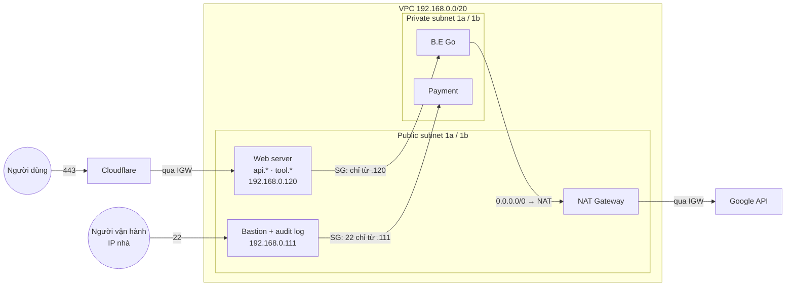

# Khái niệm kiến trúc AWS

> [!NOTE]
> Tài liệu đi từ dưới lên: tầng vật lý và ảo hoá → vì sao mỗi resource gắn với AZ hay
> Region → các bộ phận của một cái máy → thành phần mạng → kiến trúc mục tiêu của repo.
> Mỗi mục trả lời **vì sao**. Bảng chỉ xuất hiện ở cuối mục để tóm tắt điều đã hiểu.
>
> Đọc kèm:
> - [network-to-vpc.md](network-to-vpc.md) — mạng trần, chia subnet, con số giới hạn của VPC.
> - [vpc-routing-lab.md](vpc-routing-lab.md) — thực hành route table, NAT, NACL trên máy local.
> - Sơ đồ: [aws-resource-scope.drawio](../diagrams/aws-resource-scope.drawio) (mục 2) và
>   [aws-architecture.drawio](../diagrams/aws-architecture.drawio) (mục 5).

## 1. Nền tảng Ảo hóa (Virtualization Fundamentals)

Để hiểu kiến trúc mạng trên cloud, cần nắm bản chất vật lý bên dưới của Cloud Compute.

### 1.1. Bản chất của Máy chủ Ảo (Compute Virtualization)
- **Hạ tầng Vật lý (Bare Metal):** Tại các trung tâm dữ liệu, Cloud Provider vận hành các máy chủ vật lý (Hosts) với tài nguyên phần cứng khổng lồ.
- **Nghịch lý Dùng chung (Multi-tenancy) & Cách ly (Isolation):** Về bản chất kinh tế, một máy chủ vật lý lớn bắt buộc phải được chia sẻ cho nhiều khách hàng khác nhau cùng sử dụng (Multi-tenancy) để tối ưu chi phí. Câu hỏi đặt ra là: Làm sao để khách hàng A không thể đọc trộm RAM hay chiếm đoạt CPU của khách hàng B?
- **Lớp Ảo hóa (Hypervisor - Trọng tài cấp phần cứng):** 
  - Để giải quyết bài toán trên, AWS chèn vào giữa phần cứng và hệ điều hành một lớp quản lý gọi là Hypervisor (trên AWS là kiến trúc Nitro System).
  - **Cách ly CPU (Time-Slicing):** Hypervisor băm nhỏ thời gian xử lý của CPU vật lý theo đơn vị micro-giây. Máy ảo A chạy xong vi lệnh sẽ bị đóng băng trạng thái để nhường CPU cho máy ảo B. Tốc độ hoán đổi (Context Switching) nhanh đến mức Hệ điều hành bên trong máy ảo A bị "đánh lừa" và tin rằng nó đang sở hữu CPU liên tục.
  - **Cách ly Bộ nhớ (Memory Isolation thông qua MMU):** Hypervisor ánh xạ (Mapping) bộ nhớ ảo của máy ảo A vào vùng RAM vật lý từ byte 0 đến byte X, và máy ảo B từ byte Y đến Z. Khi CPU thực thi lệnh, chip quản lý bộ nhớ (MMU - Memory Management Unit) trên bo mạch chủ sẽ kiểm tra chéo. Nếu máy ảo A cố tình truy cập ra ngoài vùng được cấp phát, MMU sẽ kích hoạt ngắt phần cứng (Hardware Exception) và Hypervisor lập tức chặn đứng tiến trình này.
- **Kết quả (Compute Isolation):** Dù chia sẻ chung một bo mạch chủ, chung một thanh RAM và CPU vật lý, nhưng dưới sự áp đặt kỷ luật thép của Hypervisor ở tầng vi mạch, mỗi EC2 Instance hoàn toàn bị giam lỏng trong một "hộp cát" (Sandbox). Chúng "mù" và "điếc" hoàn toàn trước sự tồn tại của các láng giềng.

### 1.2. Sự Hình thành Mạng Ảo (Sự ra đời của VPC)
- **Bài toán Cốt lõi:** Khi hàng triệu EC2 Instance độc lập được sinh ra trên các Host vật lý khác nhau, chúng cần cơ chế giao tiếp an toàn (Networking) mà không bị lộ lọt dữ liệu (Data Leakage) giữa các khách hàng (Tenants). 
- **Sự Bất khả thi của Mạng Truyền thống:** Việc quy hoạch mạng bằng công nghệ VLAN truyền thống là bất khả thi ở quy mô đám mây (Cloud Scale) vì 3 giới hạn rào cản sau:
  1. **Giới hạn số lượng mạng (The 4K VLAN Problem):** Giao thức mạng chia lô logic truyền thống (IEEE 802.1Q VLAN) chỉ sử dụng nhãn định danh (Tag) 12-bit, nghĩa là một hệ thống vật lý chỉ có thể hỗ trợ tối đa 4,096 mạng độc lập. Với quy mô hàng chục triệu khách hàng của AWS, con số 4096 là quá nhỏ bé.
  2. **Tràn bộ nhớ Switch (MAC Table Exhaustion):** Các Switch chuyển mạch vật lý sử dụng bộ nhớ tốc độ cao CAM (Content-Addressable Memory) để lưu danh bạ địa chỉ MAC của các thiết bị. Với tốc độ khởi tạo và hủy bỏ hàng chục triệu máy ảo mỗi giây trên toàn AWS, bộ nhớ CAM của Switch vật lý sẽ lập tức bị tràn (Overflow), dẫn đến việc Switch gửi gói tin lung tung (Broadcast Storm) và làm sập toàn bộ hệ thống.
  3. **Độ trễ Cấu hình (Configuration Latency):** Cơ sở hạ tầng đám mây yêu cầu tính năng tự động hóa (Automation). Không thể lập trình các kịch bản bắt Switch vật lý tự cấu hình lại cổng (Ports) mỗi khi một máy ảo sinh ra trong vòng vài mili-giây.
- **Giải pháp - Software-Defined Networking (SDN):** Để phá vỡ các giới hạn vật lý trên, AWS phát triển một lớp mạng ảo hóa hoàn toàn bằng phần mềm. Bằng cách sử dụng các giao thức đóng gói tiên tiến (sử dụng nhãn định danh 24-bit, hỗ trợ tới 16 triệu mạng độc lập), logic định tuyến được mang thẳng lên Hypervisor, bỏ qua hoàn toàn sự phụ thuộc vào các Switch vật lý truyền thống bên dưới.
- **Sự ra đời của VPC:** Khái niệm **VPC (Virtual Private Cloud)** ra đời từ kiến trúc SDN này. Nó đóng vai trò là một "vùng bao bọc logic" (Logical Enclosure) cho phép người dùng nhóm các EC2 Instance lại với nhau thành một mạng nội bộ biệt lập. Mạng ảo này hoạt động chồng đè (Overlay Network) lên trên mạng cáp quang vật lý (Underlay Network) mà các thiết bị vật lý bên dưới không hề hay biết.

### 1.3. Nitro và các tầng chồng lên nhau trên một host

Nitro là cách AWS hiện thực hypervisor, gồm hai phần:

- **Nitro Hypervisor** — lớp phần mềm rất mỏng, chỉ lo chia CPU và RAM.
- **Nitro Card** — phần cứng riêng lo mạng VPC và đĩa EBS. Vì mạng và đĩa đi qua card riêng,
  CPU chính gần như dành trọn cho khách hàng.

Hệ quả cho cách nghĩ: card mạng ảo (ENI) và ổ đĩa (EBS) ở mục 3 đều đi vào máy qua Nitro
Card — chúng không nằm "bên trong" máy ảo theo nghĩa vật lý.

Áp vào hệ thống hiện tại:

```
Physical host (một server thật ở AZ ap-southeast-1a)
└── Nitro hypervisor                     ← chia máy, cách ly khách hàng
    ├── EC2 Logistic-Production-Node: Ubuntu 24.04 (kernel riêng)
    │   └── Podman
    │       ├── container gateway-service   ┐ dùng chung kernel
    │       └── container auth-db-master    ┘ của Ubuntu
    └── EC2 của khách hàng khác (kernel riêng, không thấy nhau)
```

**Mỗi máy ảo có kernel riêng, hypervisor nằm dưới kernel. Các container dùng chung kernel
của máy ảo chứa chúng, cách ly bằng namespace và cgroup.** Vì vậy ranh giới giữa hai EC2
dày hơn ranh giới giữa hai container trên cùng một EC2.

---

## 2. Scope: một resource "thuộc về" cái gì

### 2.1. Thuộc về nghĩa là chung số phận

"EC2 thuộc về AZ" không có nghĩa là EC2 nằm trong một thư mục tên AZ. Nó có nghĩa là:
**toà nhà của AZ đó mất điện thì EC2 chết theo**, và EC2 không tự chuyển sang AZ khác.

"Route table thuộc về VPC" nghĩa là: AZ `1a` mất điện, route table vẫn còn nguyên và vẫn
đang điều khiển traffic ở `1b`.

Scope của một resource chính là **ranh giới của một vụ sập**. Học scope là học xem thứ gì
chết cùng thứ gì — và đó là nền của mọi quyết định về High Availability.

### 2.2. Luật sinh ra mọi scope

Tiền đề đã có ở mục 1.2: logic mạng của VPC chạy trong hypervisor, không chạy trên thiết bị
vật lý riêng. Từ đó mọi resource rơi vào một trong hai loại, phân biệt bằng đúng một câu hỏi:

> **Nó có cần một cái hộp vật lý của riêng nó để làm việc không?**

- **Không cần — nó chỉ là luật.** Control plane của AWS lưu luật rồi đẩy xuống hypervisor
  của mọi host đang cần tới. Không có tiến trình riêng, không chiếm RAM của riêng ai. Thứ
  không nằm ở đâu thì cũng không chết ở đâu → scope rộng nhất mà control plane với tới:
  **Region / VPC**.
- **Cần — traffic phải chạy xuyên qua nó, hoặc nó phải chứa dữ liệu.** Cần hộp → hộp nằm
  trên một máy → máy nằm trong một toà nhà → **AZ**.

*Control plane* là phần nhận lệnh (`terraform apply` gọi vào đây), lưu cấu hình và đẩy
xuống host. *Data plane* là nơi packet thật chạy qua. Terraform chỉ nói chuyện với control
plane.

### 2.3. Soi từng resource bằng câu hỏi đó

**VPC** — chỉ là cái nhãn 24-bit hypervisor đóng lên mỗi packet (mục 1.2). Nhãn không có
chỗ ngồi → **Region**.

**Route table** — một bảng luật được đẩy xuống hypervisor → **VPC**. Đây là lý do một route
table gắn được vào nhiều subnet nằm ở nhiều AZ khác nhau: bản thân nó không ở AZ nào.

**Internet Gateway** — chỉ làm ánh xạ tĩnh 1:1 giữa private IP và public IP đã gán sẵn. Mỗi
packet xử lý độc lập, không cần nhớ gì từ packet trước, nên thiết bị biên nào của region cũng
làm được. AWS nhân bản nó khắp region → **VPC**. Đó là lý do không bao giờ phải chọn size cho
IGW, không trả tiền theo giờ cho nó, và không phải lo HA cho nó.

**NAT Gateway** — traffic của nhiều máy dồn xuyên qua nó, và nó phải nhớ từng kết nối (mục
2.5). Một chốt chặn có trí nhớ thì phải tồn tại trên một máy cụ thể → **AZ**.

*Ngoại lệ về cách đóng gói, không phải về luật:* **Regional NAT Gateway**
(`availability_mode = "regional"`) chỉ có **một ID ở cấp VPC** và không đặt vào subnet nào. Nhưng
AWS mô tả nó "mở rộng sang" từng AZ có workload và xử lý traffic "trong một AZ" — đúng kiểu
Application Load Balancer ở mục 2.6: ID thì regional, hộp vẫn theo AZ. Chi tiết ở mục 4.5.

**Security Group** — ca tinh tế nhất. SG **có** giữ state (stateful). Nhưng state đó nằm ké
trên chính hypervisor của ENI mà nó bảo vệ: ENI ở đâu, state ở đó. SG không cần cái hộp của
riêng mình → **VPC**. Vì vậy SG tham chiếu được một SG khác ở AZ khác: control plane chỉ việc
phân giải "những ENI nào đang mang SG kia" rồi đẩy danh sách IP xuống.

Từ ca này rút ra: câu hỏi đúng **không phải** "nó có state không", mà là "nó có cần chỗ ngồi
riêng không". NAT Gateway cần. Security Group đi ké.

### 2.4. Ngoại lệ: subnet — và ENI bị kéo theo

Subnet chỉ là metadata, nên theo luật ở 2.2 đáng lẽ phải là region-scoped. Nhưng subnet lại
**AZ-scoped**.

Lý do: **nhiệm vụ của subnet chính là chỉ định chỗ đặt**. Khi launch EC2 vào một subnet, AWS
phải chọn một host vật lý; subnet chính là câu lệnh "đặt nó vào toà nhà `1a`". Nếu subnet trải
qua hai AZ, bạn mất cách diễn đạt "để bản sao ở toà nhà khác" — tức mất luôn khả năng thiết kế
HA. Subnet AZ-scoped không vì bản thân nó nằm trong AZ, mà vì **nó là cái nhãn bạn dán lên
AZ**. Trong Terraform, `aws_subnet` có tham số `availability_zone`; `aws_vpc` thì không.

**ENI** bị kéo theo: ENI sinh ra bên trong một subnet và lấy private IP từ dải CIDR của subnet
đó, nên nó AZ-scoped vì subnet — không phải vì cần hộp riêng.

### 2.5. Cặp NAT Gateway – Internet Gateway

Hai resource làm **cùng một việc** (đưa packet ra Internet) nhưng scope **ngược nhau**. Cùng
nhiệm vụ, khác kết quả → chênh lệch nằm đúng ở một biến duy nhất: **state**.

- **NAT Gateway** gom nhiều private IP ra **một** public IP. Gói trả về từ Internet chỉ mang
  địa chỉ public, nên muốn biết trả cho máy nào, NAT phải ghi lại từng cặp
  `10.0.3.20:51234 ↔ 52.1.2.3:9876`. Bảng đó (connection tracking table) là state → cần RAM →
  RAM nằm trên một máy → máy nằm trong một toà nhà. AZ mất điện, bảng bay theo.
- **Internet Gateway** ánh xạ **một** private IP ↔ **một** public IP đã gán từ trước. Tra là
  ra, không cần nhớ gì giữa các packet. Không state → không hộp → không gắn AZ.

Hệ quả thiết kế của cặp này nằm ở mục 4.5: số NAT Gateway quyết định số route table.

Regional NAT Gateway không phá lập luận này, mà còn xác nhận thêm. Vì mỗi AZ vẫn phải giữ bảng
connection tracking của riêng mình, Elastic IP được khai **theo từng AZ**
(`availability_zone_address { allocation_ids = [...] }`), và khi workload xuất hiện ở một AZ mới,
AWS phải "mở rộng" NAT sang AZ đó — việc chỉ cần làm khi có phần xử lý thật đặt ở đó.

### 2.6. Kiểm chứng luật trên dịch vụ khác

- **EBS volume** — đĩa nằm trên cụm máy lưu trữ, nối vào EC2 qua mạng; đọc ghi đĩa phải đủ
  nhanh nên phải cùng toà nhà → **AZ**. Snapshot nằm trên S3 nên mới vượt được AZ.
- **RDS instance** — một máy chủ thật → **AZ**. "Multi-AZ RDS" chỉ là dựng máy thứ hai ở toà
  nhà khác rồi replicate sang.
- **S3** — dịch vụ cấp **Region**, AWS tự nhân bản dữ liệu bên trong.
- **Route 53, IAM** — thuần luật → **Global**.
- **Application Load Balancer** — resource cấp Region, nhưng khi tạo phải chọn các AZ nó chạy,
  vì AWS dựng node thật trong từng AZ đó. Luật thì regional, hộp thì AZ.

### 2.7. Tóm tắt

Đọc bảng này **sau** khi đã hiểu 2.2–2.6; mỗi dòng đều suy ra được từ câu hỏi ở 2.2.

| Resource | Scope | Vì sao |
|---|---|---|
| VPC | Region | Nhãn trên packet, không có chỗ ngồi |
| Subnet | AZ | Ngoại lệ: nhiệm vụ của nó là chỉ định chỗ đặt |
| Route table | VPC | Luật đẩy xuống hypervisor |
| Internet Gateway | VPC | Ánh xạ tĩnh 1:1, không state |
| NAT Gateway (zonal) | AZ | Chốt chặn phải nhớ từng kết nối |
| NAT Gateway (regional) | Một ID cấp VPC, xử lý trong từng AZ có workload | Như ALB: ID regional, hộp vẫn theo AZ |
| Security Group | VPC | Có state nhưng nằm ké trên ENI |
| NACL | VPC, gắn vào subnet | Luật, không state |
| ENI | AZ | Lấy IP từ subnet |
| EC2, EBS, RDS instance | AZ | Cần máy hoặc đĩa thật |
| S3 | Region | Dịch vụ tự nhân bản trong region |
| IAM, Route 53 | Global | Thuần luật |

---

## 3. Ba bộ phận của một cái máy, AWS tách ra bán riêng

Một máy tính có ba bộ phận: **não** (CPU, RAM), **ổ đĩa**, **card mạng**. Nếu ba thứ dính chặt
vào nhau, host vật lý chết là mất cả ba. AWS tách từng bộ phận thành một resource riêng để mỗi
thứ sống sót và di chuyển độc lập được.

### 3.1. EC2 instance — bộ não

EC2 (Elastic Compute Cloud) instance là một máy ảo đang chạy; "instance" nghĩa là một bản
đang chạy. `instance_type` quyết định số CPU và dung lượng RAM. EC2 chạy trên một host cụ thể
nên AZ-scoped.

### 3.2. EBS volume — ổ đĩa

EBS (Elastic Block Store) volume là ổ đĩa, và điểm cốt lõi là **nó không nằm trong host**. Đĩa
nằm trên cụm máy lưu trữ riêng, nối vào EC2 qua mạng thông qua Nitro Card, nhưng hệ điều hành
vẫn thấy nó như một ổ NVMe cắm trong máy.

- **Vì sao tách ra:** host chết thì EC2 được dựng lại trên host khác, gắn lại đĩa cũ, dữ liệu
  còn nguyên. Tách compute khỏi storage để compute thay được mà dữ liệu không mất.
- **Vì sao AZ-scoped:** đọc ghi đĩa qua mạng phải đủ nhanh; sang toà nhà khác là quá chậm.
- **"Block"** nghĩa là hệ điều hành thấy từng khối byte thô và tự format (ext4, xfs). Khác với
  S3 lưu nguyên file qua HTTP API.

**Trong repo:** khối `root_block_device` của `aws_instance.logistic_server` trong
[compute.tf](../../terraform/compute/compute.tf) là **một** EBS 30GB loại `gp3` (SSD). Toàn bộ
dữ liệu Postgres, Kafka, Elasticsearch trong các volume của `docker-compose.yml` đang nằm trên
đúng cái đĩa này.

> [!WARNING]
> Đĩa root mặc định **bị xoá khi EC2 bị huỷ** (`delete_on_termination` mặc định là `true`).
> Cộng với `user_data_replace_on_change = true`, chỉ cần sửa `user_data` là Terraform thay EC2
> mới — và mọi database mất theo. Đọc kỹ mọi dòng `must be replaced` trong `terraform plan`.

### 3.3. ENI — card mạng

ENI (Elastic Network Interface) là card mạng ảo. Nó mang:

- private IP, lấy từ dải CIDR của subnet;
- địa chỉ MAC;
- public IP hoặc Elastic IP nếu có;
- **các Security Group** — SG gắn vào ENI, không gắn vào EC2; console hiển thị trên EC2 chỉ
  cho tiện.

SSH vào EC2 chạy `ip addr`: interface `ens5` mang IP `10.0.1.x` chính là ENI nhìn từ bên trong.
Còn `eth0` trong container **không phải** ENI — đó là card ảo do Podman tạo trên bridge riêng.

Cách nhớ bằng nguyên lý: **thứ gì có IP trong VPC thì có ENI** — EC2, NAT Gateway, RDS, node
của load balancer.

**Public IP trên ENI không dùng để gọi nội bộ.** Mọi máy trong VPC gọi nhau bằng private IP, nhờ dòng
`local`. Public IP hay Elastic IP chỉ để Internet tới được đúng ENI đó, và việc dịch địa chỉ xảy ra ở
IGW, bên ngoài máy — hệ điều hành không bao giờ thấy nó (mục 4.4). Chỉ thứ phải nhận kết nối từ
Internet, như web server hay bastion, mới cần public IP.

**ENI của dịch vụ AWS do AWS tự tạo.** NAT Gateway, RDS, node của load balancer tự tạo ENI trong subnet
bạn chỉ định; bạn không tạo `aws_network_interface` cho chúng. Với NAT, chỉ cần đưa Elastic IP qua
`allocation_id`. Docs Terraform cảnh báo không dùng thuộc tính `network_interface` của `aws_eip` để gắn
vào NAT Gateway hay load balancer.

**Elastic IP được cấp lúc `apply`, không phải lúc `plan`.** Terraform gọi API cấp phát, AWS lấy một
IPv4 bất kỳ trong kho của region — trừ khi bạn dùng dải IP riêng mang vào AWS (BYOIP) hoặc IPAM. Từ
lúc đó IP thuộc về tài khoản và bắt đầu tính tiền, cho tới khi được giải phóng. "Tĩnh" nghĩa là giữ
nguyên suốt thời gian còn được cấp: qua các lần stop/start máy, và chuyển được sang máy khác trong cùng
region. Sau một vòng `destroy` rồi `apply`, bạn nhận **một IP khác** — nơi nào đang whitelist IP đi ra
của NAT sẽ gãy.

### 3.4. RDS instance — không phải bộ phận mới

RDS (Relational Database Service) instance là một gói lắp từ ba bộ phận trên: máy chạy + EBS +
database engine + tự động hoá của AWS (backup, vá lỗi, failover). Bạn nhận một hostname, không
SSH vào được.

So với hiện tại: repo tự chạy container `auth-db-master`, `auth-db-slave` và tự cấu hình
replication ([database-replication.md](../architecture/database-replication.md)).
**Multi-AZ RDS** là AWS dựng thêm một máy dự phòng ở AZ khác, chép dữ liệu sang đồng bộ, và tự
chuyển DNS sang máy đó khi máy chính chết. Read replica thì chép bất đồng bộ, giống slave hiện tại.

### 3.5. S3 — kho lưu nguyên file

S3 (Simple Storage Service) lưu nguyên file (object) qua HTTP API, ở cấp Region. Terraform state
của repo nằm trong bucket `chuong-logistic-bucket`.

---

## 4. Thành phần mạng

### 4.1. VPC (Virtual Private Cloud)

- **Bản chất:** VPC không phải mạng vật lý. Nó là mạng định nghĩa bằng phần mềm (SDN) vận hành
  trên Nitro, dùng giao thức đóng gói để tạo mạng chồng (overlay) lên mạng cáp thật. Nhờ vậy hàng
  triệu khách hàng dùng chung được một dải IP như `10.0.0.0/16` mà không xung đột.
- **Cách ly:** mặc định không có luồng nào vào hay ra, trừ khi bạn gắn thiết bị định tuyến (IGW,
  NAT Gateway...). Không thể bắt gói tin chéo giữa các VPC.
- **Scope:** Region, trải qua mọi AZ trong region (mục 2.3).

### 4.2. Subnet

Subnet là một dải con cắt ra từ CIDR của VPC, gắn vào đúng một AZ (mục 2.4). Trong VPC không còn
broadcast, nên chia subnet không phải để cắt broadcast domain như mạng thường, mà để **gắn được
route table và NACL khác nhau** cho từng nhóm máy.

"Public subnet" không phải một thuộc tính hay một ô tick: subnet là public **khi và chỉ khi**
route table của nó có dòng `0.0.0.0/0 → igw`. Chi tiết: [network-to-vpc.md](network-to-vpc.md)
mục 3.4.

### 4.3. Route table

#### Route table gắn vào subnet, không gắn vào EC2

Không tồn tại trạng thái "EC2 chưa có route table". Route table luôn gắn vào **subnet**, và mỗi
subnet **luôn có đúng một** route table:

- bảng được associate tường minh (`aws_route_table_association`), hoặc
- nếu không associate, subnet tự dùng **main route table** — bảng AWS sinh ra cùng VPC.

Ngược lại, một route table gắn được vào nhiều subnet (mục 2.3).

Đừng lẫn hai quan hệ của một route table:

- **Association — subnet nào dùng bảng này.** Nhiều subnet → một bảng; mỗi subnet đúng một bảng.
  Association áp cho **cả subnet**, tức mọi ENI và mọi IP trong đó, không gán theo từng IP. Trong
  Terraform mỗi cặp là một `aws_route_table_association`; trong API của AWS mỗi cặp có ID riêng dạng
  `rtbassoc-…`.
- **Route — packet đi đâu.** Mỗi dòng là `đích → target`. Mỗi đích chỉ có một dòng, nên `0.0.0.0/0`
  chỉ trỏ được về một nơi.

Nhìn bằng con mắt backend, association là một bảng nối trong database:
`route_table_associations(subnet_id UNIQUE, route_table_id)`. `UNIQUE` trên `subnet_id` là luật
"mỗi subnet một bảng"; không có ràng buộc nào trên `route_table_id` là luật "một bảng nhiều subnet".
Tách association thành resource riêng cho phép chuyển một subnet sang bảng khác mà không phải xoá
bảng hay xoá subnet.

#### Hai tầng routing

**Tầng 1 — bên trong hệ điều hành của EC2.** `ip route` trên EC2 cho ra đại loại:

```
default via 10.0.1.1 dev ens5
```

Ubuntu trong EC2 không biết gì về NAT, IGW hay route table. Luật của nó chỉ có một câu: đích nằm
ngoài subnet của tôi thì đưa cho `.1`. Địa chỉ `.1` là một trong 5 IP AWS giữ lại mỗi subnet —
**router ngầm của VPC**.

**Tầng 2 — route table của VPC.** Đây là **bộ não của router `.1`**, chạy trong hypervisor. Mọi
quyết định đi cửa nào nằm ở tầng này.

EC2 vì thế không bao giờ "không biết đi đâu": nó luôn đưa cho `.1`. Còn `.1` chuyển tiếp hay vứt
packet là do route table của subnet quyết định.

#### Mỗi dòng: đích → cửa ra, và dòng cụ thể nhất thắng

Mỗi dòng gồm `destination` (một dải CIDR) và `target` (cửa ra: `local`, `igw-…`, `nat-…`). Không
có cột "cho phép" hay "chặn" — route table chỉ trả lời **đi đường nào**. Nhiều dòng cùng khớp thì
dòng có prefix dài nhất thắng (longest prefix match, [network-to-vpc.md](network-to-vpc.md) mục
1.4). `0.0.0.0/0` khớp mọi đích nhưng luôn thua.

Dòng `<CIDR của VPC> → local` được AWS tự thêm vào **mọi** route table và **không xoá được**. Vì
vậy mọi subnet trong cùng VPC luôn đến được nhau, và route table không dùng để cách ly các tầng —
việc đó thuộc về Security Group và NACL (mục 4.6).

#### Main route table: chỉ có `local`

Với VPC tự tạo (như `aws_vpc.logistic_vpc`), main route table lúc mới sinh **chỉ có đúng một
dòng** `local`. Không có `0.0.0.0/0`, và NAT Gateway không bao giờ tự xuất hiện — đó là resource
tính tiền, phải tự tạo.

Hệ quả: subnet dùng main route table gọi được mọi máy trong VPC nhưng **không ra được Internet**.
Packet tới `8.8.8.8` không khớp dòng nào và bị vứt ngay tại router `.1` — phía ứng dụng chỉ thấy
timeout.

**Default VPC thì khác:** VPC mà AWS tạo sẵn cho mọi tài khoản có main route table chứa sẵn
`0.0.0.0/0 → igw`, để người mới bật EC2 là vào được Internet ngay.

Nguyên tắc thiết kế rút ra: **để main route table chỉ có `local`**. Subnet nào lỡ quên associate
sẽ bị cô lập — lỗi theo hướng an toàn. Thêm `0.0.0.0/0 → igw` vào main route table thì subnet bị
quên sẽ âm thầm thành public.

#### Vậy có cần tự tạo route table không?

Câu hỏi đúng là: **subnet này có cần đi đâu ngoài VPC không?**

- **Không** — chỉ gọi nội bộ, không bao giờ ra Internet: dòng `local` là đủ, không cần dòng nào khác.
  Vẫn nên associate tường minh với một bảng chỉ có `local`, để người đọc code thấy đó là chủ ý chứ
  không phải bị quên.
- **Có** — ra IGW, ra NAT, sang VPC khác: phải có một dòng ngoài `local`, và dòng đó **không nên** nằm
  trong main route table, vì ba lý do:
  1. Main route table là chỗ rơi của mọi subnet bị quên associate. Thêm `0.0.0.0/0 → igw` vào đó là
     biến lỗi "quên" thành lỗi "lộ ra Internet". Thêm `0.0.0.0/0 → nat` thì nhẹ hơn (NAT chỉ cho đi
     ra), nhưng vẫn âm thầm mở đường đi ra cho mọi subnet bị quên — kể cả subnet đáng lẽ phải bị cô
     lập, như tầng database.
  2. Một route table chỉ có **một** dòng `0.0.0.0/0`. Thiết kế mỗi AZ một NAT zonal cần mỗi AZ trỏ về
     một NAT khác nhau — một bảng không chứa nổi.
  3. Main route table do AWS tạo, **không nằm trong code**. Sửa nó trên console thì đọc `network.tf`
     không ai biết. Terraform chạm vào nó được theo hai cách:
     - Thêm **một dòng** bằng resource `aws_route`, với `route_table_id = aws_vpc.<tên>.main_route_table_id`.
       Không tiếp quản cả bảng.
     - Tiếp quản **cả bảng** bằng `aws_default_route_table`. Docs provider cảnh báo: lần tiếp quản
       đầu tiên nó *"immediately removes all defined routes"*, chỉ còn lại dòng `local`.

     Dù dùng cách nào, subnet không có association trong code thì người đọc không phân biệt được là
     **cố ý** dùng main hay **quên** gắn bảng.

Cách làm thực tế: tạo route table riêng cho mọi nhóm subnet cần đi ra, associate tường minh **mọi**
subnet, và để main route table nguyên trạng làm lưới an toàn.

#### Mỗi chiều tra route table của subnet nơi packet rời đi

Chiều đi và chiều về được tra **độc lập**, mỗi chiều bằng route table của subnet mà packet đang
rời khỏi. Ví dụ A và B ở hai subnet khác nhau, cùng VPC `192.168.0.0/20`:

```
CHIỀU ĐI: A (192.168.0.120) → B
  OS của A: đích ngoài subnet → đưa cho router .1
  Router .1 tra route table CỦA SUBNET A:
      192.168.0.0/20 → local   ✔ khớp, /20 dài hơn → thắng
      0.0.0.0/0      → nat     ✔ cũng khớp, nhưng /0 thua
  → giao thẳng trong VPC
  → NACL biên subnet A (ra) → NACL biên subnet B (vào) → SG của B → B nhận

CHIỀU VỀ: B → A
  Router .1 tra route table CỦA SUBNET B
  (bảng tường minh hoặc main route table — bảng nào cũng có dòng local)
      192.168.0.0/20 → local   ✔ → giao thẳng về A
  → NACL biên subnet B (ra) → NACL biên subnet A (vào) → SG của A → A nhận
```

Hai hệ quả:

- Không cần thêm route tới private IP của máy khác trong VPC — dòng `local` đã phủ.
- Chiều về trong VPC **không bao giờ đi qua NAT**, kể cả khi subnet của B có `0.0.0.0/0 → nat`.

Nếu chiều đi thông mà chiều về chết, thủ phạm gần như chắc chắn là NACL (mục 4.6), không phải
route table.

### 4.4. Internet Gateway (IGW)

IGW là cửa hai chiều giữa VPC và Internet, mỗi VPC một cái. Nó dịch tĩnh 1:1 giữa public IP
(hoặc Elastic IP) và private IP của từng máy. Hệ điều hành trong EC2 không bao giờ thấy public IP
của chính nó ([network-to-vpc.md](network-to-vpc.md) mục 3.4). Máy không có public IP thì dù nằm
trong public subnet cũng không ra được Internet: IGW không có gì để dịch.

Vì sao IGW không gắn AZ và không cần lo HA: mục 2.5.

### 4.5. NAT Gateway

NAT Gateway cho máy trong private subnet **đi ra** Internet, nhưng Internet không chủ động gọi vào
được. Cơ chế là PAT ([networking.md](networking.md) mục 4).

AWS có hai chế độ, chọn bằng `availability_mode`. Mặc định là **zonal** — chế độ mà các ý dưới đây
và mục 2 đang tả. Chế độ **regional** nằm ở cuối mục này.

- **Phải nằm trong public subnet** và có Elastic IP (`subnet_id` và `allocation_id`). Nghe ngược đời nhưng đúng: bản thân NAT cần
  route ra IGW. Đặt nhầm vào private subnet thì `terraform apply` vẫn thành công, nhưng không máy
  nào ra được Internet.
- **Gắn với đúng một AZ**, vì phải giữ connection tracking table (mục 2.5).
- **Khai `depends_on` tới Internet Gateway.** NAT không tham chiếu IGW ở thuộc tính nào, nên Terraform
  không thấy phụ thuộc này và có thể tạo hai thứ song song — trong khi AWS yêu cầu VPC phải có IGW
  trước (lỗi *"Network vpc-xxxxxxxx has no internet gateway attached"*). Chiều ngược lại cũng vậy: lúc
  `destroy`, không có cạnh này thì Terraform có thể gỡ IGW khi NAT vẫn còn giữ Elastic IP.
  `terraform graph` cho thấy cạnh NAT → IGW chỉ xuất hiện khi có `depends_on`.

#### Số NAT Gateway quyết định số route table

Dòng `0.0.0.0/0` của route table private phải trỏ vào **một NAT Gateway cụ thể**, và mỗi route
table chỉ có một dòng `0.0.0.0/0`. Từ đó:

| Thiết kế | Route table public | Route table private | Tổng |
|---|---|---|---|
| 1 NAT Gateway dùng chung | 1 — cả hai subnet public trỏ cùng IGW | 1 — cả hai subnet private trỏ cùng NAT | **2** |
| Mỗi AZ một NAT Gateway | 1 — IGW không gắn AZ | 2 — `private-1a → nat-1a`, `private-1b → nat-1b` | **3** |

Bảng public không bao giờ cần tách theo AZ, vì IGW không gắn AZ.

**Route table không chết theo AZ — nhưng đó không phải điểm mấu chốt.** Route table là resource cấp
VPC, AZ sập thì nó vẫn còn nguyên. Vấn đề là nó *còn nguyên* và vẫn trỏ `0.0.0.0/0` vào NAT đã chết:
route table là cấu hình tĩnh, AWS không tự đổi hướng sang NAT còn sống. Nếu hai AZ có hai NAT mà chỉ
dùng chung một bảng private trỏ vào NAT-1a, thì NAT-1b nằm không — không route nào dẫn tới nó — và
khi AZ 1a sập, private-1b mất đường ra dù cả AZ 1b lẫn NAT-1b vẫn khoẻ. Hai bảng private giúp mỗi AZ
chỉ phụ thuộc vào NAT của chính nó: AZ nào sập thì chỉ máy của AZ đó mất đường ra, mà những máy đó vốn
đã chết cùng AZ rồi. Nói gọn: **số route table do số đích khác nhau quyết định, không do scope của
route table.**

#### Một NAT hay mỗi AZ một NAT

| | 1 NAT dùng chung | Mỗi AZ một NAT |
|---|---|---|
| AZ chứa NAT sập | Private subnet ở **cả hai** AZ mất đường ra, dù AZ kia vẫn khoẻ | Chỉ AZ sập bị ảnh hưởng |
| Phí data transfer | Traffic từ AZ không có NAT phải đi chéo AZ (~0,01 USD/GB mỗi chiều) | Không đi chéo AZ |
| Phí theo giờ | 1 NAT | Gấp đôi |

Một NAT cho thiết kế hai AZ nghĩa là đường ra Internet vẫn phụ thuộc một AZ. Với môi trường học có
`terraform destroy` sau mỗi buổi, đó là đánh đổi chấp nhận được — miễn là được ghi thành quyết định
có chủ đích. Giá NAT: [network-to-vpc.md](network-to-vpc.md) mục 3.5.

#### Regional NAT Gateway

Chế độ `availability_mode = "regional"` gói phần "mỗi AZ một NAT" lại sau **một ID duy nhất**:

- **Không đặt vào subnet nào**, chỉ gắn vào VPC (`vpc_id`, không có `subnet_id`), nên không cần
  public subnet để chứa nó. AWS tự tạo cho nó một route table riêng có sẵn dòng ra IGW. Bảng này
  đóng đúng vai "route table của public subnet chứa NAT" ở chế độ zonal, nên VPC vẫn phải có IGW.
- **Tự đi theo workload:** phát hiện ENI ở một AZ mới thì tự mở rộng sang AZ đó; AZ không còn
  workload thì tự rút. Mở rộng có thể mất **tới 60 phút**. Trong lúc đó, traffic của AZ mới được xử
  lý **chéo AZ** ở một AZ đang có NAT — tức quay lại đúng rủi ro và phí đi chéo AZ của phương án một
  NAT dùng chung.
- **Elastic IP khai theo từng AZ.** Chế độ tự động (không khai `availability_zone_address`): AWS tự
  cấp IP và tự mở rộng. Chế độ thủ công (có khai): mỗi khối `availability_zone_address` gồm một AZ
  và `allocation_ids` — danh sách EIP mà traffic đi ra từ **AZ đó** dùng làm địa chỉ nguồn. Đã khai
  thì hết tự mở rộng; thêm AZ mới là việc của bạn.
- **Vì sao `allocation_ids` là một danh sách:** mỗi IP mở được khoảng 55.000 kết nối đồng thời tới
  cùng một đích (cùng IP, cổng, giao thức). Thêm một IP là thêm 55.000. Regional cho tới 32 IP mỗi
  AZ; zonal tối đa 8.
- **Giới hạn:** không hỗ trợ private NAT (`connectivity_type` phải là `public`), và không có ở các
  AZ bị giới hạn năng lực (constrained AZ).

**Vì sao regional không có `subnet_id` và `allocation_id`** — không phải vì "HA thì không được khai":

- `subnet_id` là câu lệnh chỉ chỗ đặt, và một subnet chỉ nằm trong **một** AZ (mục 2.4). NAT zonal
  là một hộp ở một toà nhà, nên khai đúng một chỗ đặt. NAT regional là nhiều hộp ở nhiều toà nhà do
  AWS tự đặt theo workload; một `subnet_id` sẽ ghim nó vào một AZ, trái với chính định nghĩa của nó.
  Vì vậy nó nhận `vpc_id` — thứ duy nhất trải qua mọi AZ.
- `allocation_id` là **một** Elastic IP. Với NAT zonal, IGW ánh xạ 1:1 Elastic IP đó với private IP
  của NAT — một địa chỉ trên một ENI, trong một subnet, ở một AZ. Gói trả về từ Internet phải về đúng
  hộp đang giữ bảng connection tracking của kết nối đó; nhiều hộp ở nhiều AZ mà chung một Elastic IP
  thì chuỗi ánh xạ 1:1 này gãy. Nên ở regional, Elastic IP được khai **theo từng AZ**
  (`availability_zone_address`), hoặc để AWS tự cấp. AWS không mô tả chi tiết bên trong regional
  NAT; lập luận này suy từ cơ chế của zonal và từ việc AWS bắt khai Elastic IP theo AZ.
- **HA không đồng nghĩa với regional.** Mỗi AZ một NAT zonal cũng là HA; khi đó vẫn khai `subnet_id`
  và `allocation_id`, chỉ là khai cho từng NAT — mỗi NAT một public subnet và một Elastic IP riêng.

**Hệ quả lên số route table:** mọi private subnet ở mọi AZ trỏ `0.0.0.0/0` về **cùng một NAT ID**,
nên **một** route table private là đủ, mà mỗi AZ vẫn có đường ra riêng. Bảng "Số NAT Gateway quyết
định số route table" ở trên chỉ đúng với chế độ zonal.

**Chọn gì cho repo này:** chế độ zonal buộc bạn tự dựng từng mảnh — public subnet, route ra IGW,
route table theo AZ — nên dạy được cơ chế. Regional giấu các mảnh đó đi. Nên dựng zonal trước để
hiểu, rồi mới đổi sang regional. Đổi từ zonal sang regional sẽ ngắt các kết nối đang có. Cách tính
giá của regional: xem trang giá VPC của AWS — tài liệu này chưa đối chiếu.

Nguồn: AWS VPC User Guide, mục *Regional NAT gateways for automatic multi-AZ expansion*; Terraform
AWS provider 6.54, resource `aws_nat_gateway`.

### 4.6. Security Group và NACL

Route table trả lời **đi đường nào**. Hai lớp dưới đây trả lời **có được qua không**.

**Security Group** — tường lửa gắn vào ENI.

- **Stateful:** SG ghi nhận kết nối đã được cho phép, nên gói trả về tự được qua, không cần viết
  luật chiều về.
- **Chỉ có luật allow.** Không thể viết "chặn IP X" trong SG.
- **Nguồn có thể là một SG khác**, không chỉ CIDR: `sg-postgres` mở cổng 5432 cho
  `sg-auth-service`. Luật mô tả vai trò chứ không mô tả vị trí, nên vẫn đúng khi máy đổi IP.

**NACL** (Network Access Control List) — tường lửa gắn vào biên subnet.

- **Stateless:** mỗi gói bị xét như gói lạ, phải tự mở cả hai chiều.
- **Có cả allow lẫn deny.** Luật đánh số, xét theo thứ tự tăng dần, khớp là dừng, cuối cùng là một
  `*` DENY ngầm. Đây là chỗ chặn tường minh được một IP cụ thể.
- **Chỉ nói bằng CIDR**, không tham chiếu được SG — nên là lớp lọc thô.

**Cái bẫy chiều về của NACL:** B trả lời A từ cổng dịch vụ, nhưng gói về tới **một cổng ngẫu nhiên
phía A** (ephemeral port, 1024–65535). NACL không mở dải này thì chiều đi vẫn thông mà chiều về
chết — triệu chứng rất giống lỗi routing, nhưng nguyên nhân nằm ở NACL.

Thứ tự với packet đi vào: NACL (biên subnet) trước, SG (ENI) sau. Packet đi ra: SG trước, NACL sau.
So sánh đầy đủ và giới hạn số luật: [network-to-vpc.md](network-to-vpc.md) mục 3.6.

### 4.7. Ba câu hỏi cho mỗi packet

Mọi sự cố "không kết nối được" trong VPC quy về ba câu, theo đúng thứ tự:

1. **Route table của subnet nguồn:** packet đi cửa nào — `local`, IGW, NAT, hay không khớp dòng
   nào nên bị vứt?
2. **NACL** ở biên subnet nguồn (chiều ra) và subnet đích (chiều vào): có cho qua không? Chiều về
   phải tự mở.
3. **Security Group** ở ENI đích: có cho vào không? Chiều về tự được qua.

Chuỗi kiểm soát đầy đủ, tới tận Podman và tiến trình đang listen:
[network-to-vpc.md](network-to-vpc.md) mục 3.7.

---

## 5. Kiến trúc mục tiêu: bản vẽ `aws-architecture.drawio`

Bản vẽ [aws-architecture.drawio](../diagrams/aws-architecture.drawio) là hướng thiết kế mục tiêu.
Nó chưa khớp với Terraform hiện tại (mục 6); các điểm lệch nằm ở mục 5.3.

### 5.1. Bốn luồng trong bản vẽ

**Luồng 1 — người dùng gọi API.** Request tới **web server** ở public subnet (Elastic IP, private
IP `192.168.0.120`, phục vụ `api.*` và `tool.*`), rồi được chuyển tiếp sang **B.E Go** ở private
subnet. SG của B.E Go chỉ nhận một cổng, và chỉ từ đúng IP của web server. Internet không chạm được
tới backend: backend không có public IP, và không có route nào từ ngoài vào.

**Luồng 2 — backend gọi ra ngoài.** B.E Go gọi Google API (đăng nhập Google,
[oauth-google-flow.md](../architecture/oauth-google-flow.md)). Route table private
`0.0.0.0/0 → nat-id` → NAT Gateway đổi địa chỉ nguồn thành NAT IP → IGW → Internet.

**Luồng 3 — quản trị máy.** Người vận hành SSH từ IP nhà vào **bastion** ở public subnet (Elastic
IP, `192.168.0.111`, SG chỉ mở 22 cho IP nhà, có ghi audit log). Từ bastion mới SSH tiếp sang
**Payment** ở private subnet, và SG của Payment chỉ nhận 22 từ `192.168.0.111`. Chỉ có một cửa SSH,
và mọi thao tác qua cửa đó đều bị ghi lại.

**Luồng 4 — xem cổng nội bộ mà không mở cổng.**

```bash
ssh -L 19092:127.0.0.1:9092 -L 18090:127.0.0.1:8090 ubuntu@<public-ip>
```

Cổng 19092 trên laptop được nối xuyên qua phiên SSH tới cổng 9092 (Kafka) trên máy chủ, nên không
cần mở 9092 ra Internet. Ghi chú `listen: 0.0.0.0:9092` cùng ba địa chỉ `127.0.0.1`,
`192.168.0.10`, `123.123.123.123` trong bản vẽ minh hoạ: tiến trình bind `0.0.0.0` nhận kết nối
trên **mọi** interface — loopback, private IP, và public IP.

### 5.2. Sơ đồ rút gọn



### 5.3. Các điểm phải chốt trước khi viết Terraform

1. **Dải CIDR của VPC.** Bản vẽ dùng `192.168.0.0/20` (4.096 địa chỉ, từ `192.168.0.0` tới
   `192.168.15.255`). Terraform dùng `10.0.0.0/16`, và [network-to-vpc.md](network-to-vpc.md) mục
   2.7 khuyên tránh `192.168.x.x` vì trùng router gia đình. Trùng dải chỉ gây lỗi khi hai mạng bị
   **nối routing** với nhau (client VPN, peering); SSH tunnel không bị ảnh hưởng. Đổi `cidr_block`
   của `aws_vpc` buộc Terraform **xoá VPC và tạo lại** cùng mọi thứ bên trong.
2. **Số NAT Gateway và chế độ NAT.** Bản vẽ có một NAT dùng chung. Có ba lựa chọn: một NAT zonal
   dùng chung, mỗi AZ một NAT zonal, hoặc một Regional NAT Gateway. Đánh đổi ở mục 4.5.
3. **Số route table.** Bản vẽ vẽ bốn bảng, mỗi subnet một bảng. Theo mục 4.5, một NAT zonal cần
   **hai** bảng, mỗi AZ một NAT zonal cần **ba**, còn Regional NAT Gateway cần **hai** (một public
   cho web server và bastion, một private) dù chạy bao nhiêu AZ.
4. **SG viết bằng IP hay tham chiếu SG.** Bản vẽ ghi `192.168.0.120 -> 3000`. Nếu web server bị
   thay mới và nhận IP khác, luật theo IP sẽ sai; luật tham chiếu SG thì không.
5. **Cổng và upstream của nginx.** Gateway thật chạy cổng `8080`, không phải `3000`. nginx hiện trỏ
   `server 127.0.0.1:8080` ([logistic.conf](../../nginx/logistic.conf)) — chạy được chỉ vì nginx và
   gateway nằm chung một máy. `127.0.0.1` là loopback, không bao giờ ra khỏi máy; khi tách web
   server và backend ra hai subnet, upstream phải trỏ tới private IP hoặc DNS nội bộ của backend.
6. **Bastion hay SSM.** Bản vẽ chọn bastion có audit log; [network-to-vpc.md](network-to-vpc.md)
   mục 4.6 đề xuất SSM.

   | | Bastion + audit log | SSM Session Manager |
   |---|---|---|
   | Cổng inbound | Mở 22 trên bastion | Không mở cổng nào |
   | Xác thực | SSH key + whitelist IP nhà; IP nhà đổi là mất quyền vào | IAM |
   | Dấu vết | Tự dựng việc ghi phiên trên bastion | Log phiên vào CloudTrail/S3 |
   | Điều kiện | Một EC2 + Elastic IP chạy thường trực | SSM agent + IAM role + đường tới SSM (NAT hoặc endpoint) |
   | Học được gì | Cơ chế SSH, jump host, tunnel `-L` | IAM, endpoint, mô hình không mở cổng |

---

## 6. Hiện trạng triển khai

Đọc thẳng từ [network.tf](../../terraform/network/network.tf) và
[compute.tf](../../terraform/compute/compute.tf):

| Thành phần | Hiện trạng |
|---|---|
| State | S3 backend `chuong-logistic-bucket`, tách `network` và `compute`, có lock; `compute` đọc `network` qua `terraform_remote_state` |
| VPC | Tự tạo, `10.0.0.0/16` |
| Subnet | **Một** public subnet `10.0.1.0/24` ở `ap-southeast-1a`, `map_public_ip_on_launch = true` |
| Route table | Bảng public `0.0.0.0/0 → IGW`, associate tường minh với subnet trên; main route table để mặc định (chỉ `local`) |
| NAT Gateway | Chưa có |
| EC2 | Một instance Ubuntu 24.04, EBS root 30GB `gp3`, `user_data` cài Podman + nginx; chạy toàn bộ stack bằng `podman-compose` |
| Security Group | 22 từ một IP nhà; 80/443 từ các dải IP của Cloudflare; egress mở hết |
| DNS | Cloudflare record `api` trỏ public IP của EC2, bật proxy |

Rủi ro của hiện trạng và lộ trình tách tầng: [network-to-vpc.md](network-to-vpc.md) mục 4.1 và 4.3.

---

## 7. Tự kiểm chứng

Thực hành không tốn tiền trên máy local trước: [vpc-routing-lab.md](vpc-routing-lab.md).

Khi hạ tầng AWS đang bật (các lệnh dưới đây chỉ đọc):

```bash
# Tầng 1: OS trong EC2 chỉ biết "đưa cho .1"
ip route

# Tầng 2: main route table của VPC có những dòng nào
aws ec2 describe-route-tables \
  --filters Name=vpc-id,Values=<vpc-id> Name=association.main,Values=true \
  --query 'RouteTables[].Routes'

# Subnet đang được associate tường minh với bảng nào
aws ec2 describe-route-tables \
  --filters Name=association.subnet-id,Values=<subnet-id> \
  --query 'RouteTables[].{RT:RouteTableId,Routes:Routes}'
```

Lệnh cuối không trả về bảng nào nghĩa là subnet đó đang dùng main route table.

Các lệnh kiểm chứng IGW 1:1, SG stateful và cổng giữa các tầng:
[network-to-vpc.md](network-to-vpc.md) mục 4.7.
